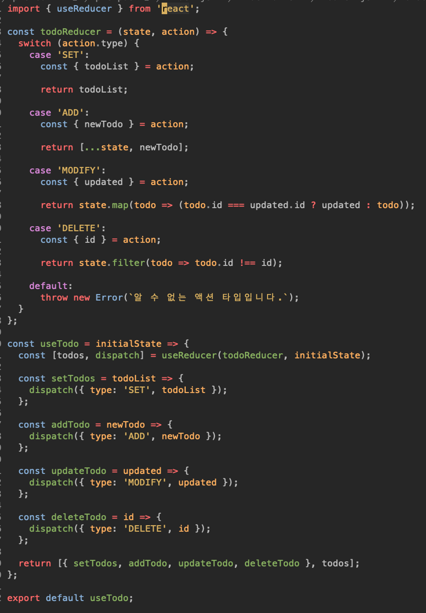

# 실제 예시로 설명

<figure><figcaption></figcaption></figure>

이 코드는 과연 관심사의 분리 입장에서 좋은 코드일까?

정답은 그렇다!

왜냐하면 아래의 setTodos, addTodo 등에 함수를 보면&#x20;

type, 두번째 인자로 '무엇을' 로 분리되어있고

위의 todoReducer는 '어떻게' 로 분리되어있다.

무엇 / 어떻게 처럼 하나의 관심사만을 가지고 있는 코드들이다.

이로 인한 장점이 무엇이 있을까 ?

사실 퍼포먼스에는 차이가 없다.

그러나 로직이 변경되어 특정 관심사를 바꿔야할때 해당하는 함수만을 바꾸면 된다.

나머지는 그대로 냅두면 됨.
