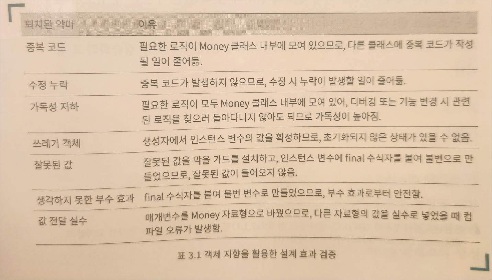

# 3. 클래스 설계 : 모든 것과 연결되는 설계 기반

### 3.1 클래스 단위로 잘 동작하도록 설계하기

#### 3.1.1 클래스의 구성 요소

* 인스턴스 변수
* 메서드

메서드의 역할을 명확하게 해야함.

잘 만들어진 클래스는 다음 두가지로 구성.

* 인스턴스 변수
* <mark style="background-color:green;">인스턴스 변수에 잘못된 값이 할당되지 않게 막고, 정상적으로 조작하는</mark> 메서드

### 3.2 성숙한 클래스로 성장시키는 설계 기법

#### 3.2.1 생성자로 확실하게 정상적인 값 설정하기

<mark style="background-color:green;">적절한 초기화 로직</mark>을 생성자에 구현

잘못된 값이 유입되지 못하게 <mark style="background-color:green;">유효성 검사를 생성자 내부에 정의</mark>, 잘못된 값이라면 곧바로 예외 발생

#### 3.2.3 불변 변수로 만들어서 예상하지 못한 동작 막기

비즈니스 요구 사항이 바뀌어서 코드를 수정하다가 의도하지 않은 값을 할당하는 '예상치 못한 부수 효과'가 쉽게 발생. 이를 막으려면, <mark style="background-color:green;">인스턴스 변수를 불변</mark>을 만듦.

### 3.3 악마 퇴치 효과 검토하기

<figure><figcaption></figcaption></figure>

클래스 설계란 인스턴스 변수가 잘못된 상태에 빠지지 않게 하기 위한 구조를 만드는 것.

### 3.4 프로그램 구조의 문제 해결에 도움을 주는 디자인 패턴

#### 3.4.2 값 객체(value object)

값 객체란 값을 클래스로 나타내는 디자인 패턴.

'값 객체 + 완전 생성자'를 활용해서 설계하면, 제약과 의도를 자료형으로 표현할 수 있으며, 안전한 코드를 작성할 수 있다.

