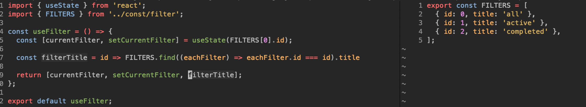

# 실제 예시

<figure><figcaption></figcaption></figure>

위 코드는 절차지향적인 코드이다.

왜냐하면 한번 코드를 보면

"title을 선언한다. 그리고 나는 만약 id가 동일하다면 title에 filter의 title을 할당해줄거야 그리고 title을 리턴해줄게"

라고 코드의 흐름(절차)가 있다.

고로 이 코드를 이해하려면 위에서부터 쭈욱 흐름을 따라와야만 최종적인 코드를 이해할 수 있게된다.

그러나 최근 트렌드는 "선언적인 코드"

<figure><figcaption></figcaption></figure>

7번째 줄을 유심히 보면&#x20;

여기는 이 한줄만으로 모든 설명이 끝이 난다.

"나는 id 를 인자를 받아서 id와 맞는걸 찾는다. 찾아서 title을 리턴해준다."

\~\~ 한다

라고 선언하는 코드.

물론, \~ 한다는 위에 절차에도 일부 포함은 됨.

그런데 문제는 다양한 어구가 들어가면서 흐름이 생기는 거고&#x20;

여기서는 뭐 한다 그다음 뭐한다 뭐한다 뭐한다 가 정확한 것 같다.

\=> 코드의 의도가 명확하게 들어난다.

사실 위의 절차적인 코드의 로직들이 선언적 코드 안에서도 똑같이 존재한다 어디에 ?

array 내장 함수 find 에 .

(유인동 강의가 생각나는군 ;)

