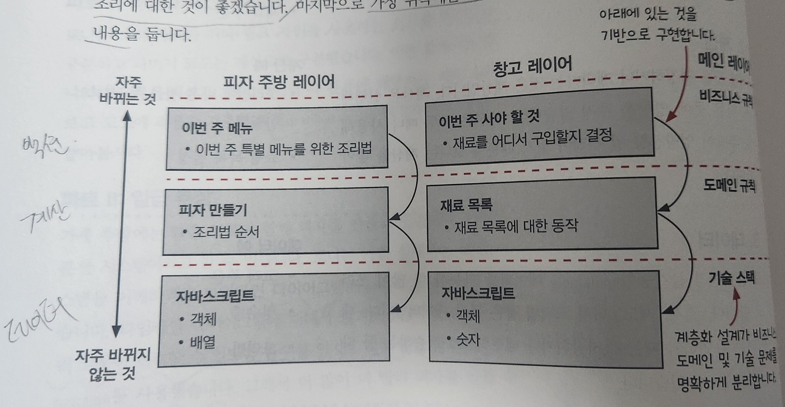

# 2. 현실에서의 함수형 사고

현실 세계의 피자를 만드는 과정을 예시로 들어 함수형 사고를 적용해 봅니다.

### 액션과 계산, 데이터

가장 먼저 액션/계산/데이터를 구분해봅니다.

1\) 액션

액션은 호출 횟수와 시점에 의존하는 것입니다.

* 반죽 펴기 : 반죽이 만들어져 있어야 피기 시작 가능합니다.
* 피자 배달 : 피자가 완성 되어야 배달 시작 가능합니다.
* 재료 주문 : 피자 판매량에 따라 주문량이 달라집니다.

2\) 계산

* 조리법에 나온 것에 양을 두배 적용하기
* 쇼핑 목록 결정

3\) 데이터

* 고객 주문
* 영수증
* 조리법

### 변경 가능성에 따라 코드 나누기

몇가지 액션/계산/데이터에 대한 특징들을 얘기했지만&#x20;

코드를 가장 손쉽게 구분할 수 있는 것은 <mark style="background-color:green;">'변경 가능성'</mark> 입니다.

<figure><figcaption></figcaption></figure>

<mark style="background-color:orange;">위의 사진의 분류처럼 액션/계산/데이터 로 구분하는게 맞지 않을 수 있습니다.</mark>

<mark style="background-color:orange;">좀더 단위가 큰 단위를 여기선 말하고 있을 수 있습니다.</mark>

코드에서 가장 '변경 가능성'이 없는것은 무엇일까요 ?

그것은 바로 프로그램이 만들어지는 <mark style="background-color:green;">'기술  스택'</mark>입니다.

그리고 우리가 하는 비즈니스의 기반이 되는 <mark style="background-color:green;">'도메인 규칙'</mark>

그 다음으로 남은건 호출 횟수와 시점에 의존하는 <mark style="background-color:green;">'비즈니스 규칙'</mark>

이 아키텍처 패턴이 계층을 만들기 때문에 우리는 이것을 <mark style="background-color:green;">'계층형 설계'</mark> 라고 부릅니다.

### 일급 추상

하나의 로봇이 일하는건 속도의 제한이 있습니다. 우리는 이걸 개선해보기로 합니다.

그러나 피자만드는데에는 순서가 있습니다. 어떤게 되어야 다음껄 할 수 있는.&#x20;

그걸 우리는 시각적으로 '타임라인 다이어그램' 을 만들어봅니다.

<figure><figcaption></figcaption></figure>

속도를 개선하기 위해 로봇 여러대를 사용하더라도 '준비하고' -> '사용하고' 의 순서를 지켜야하기 때문에 <mark style="background-color:green;">'버그'</mark>가 발생합니다. 병렬적으로 일이 효율적으로 처리되지 못합니다.

#### 어려운 경험을 통해 분산 시스템에 대해 배운 것

우리는 올바른 순서로 동작하는 프로그램을 만들려면 <mark style="background-color:green;">'액션(시간에 의존적인)'</mark>에 집중할 필요가 있다.

1. 타임라인은 서로 순서를 스스로 맞추지 않습니다.
2. 액션이 실행 지속시간은 중요하지 않습니다.(순서가 중요합니다)
3. 병렬로 하면 타이밍이 어긋나는 경우가 실제 일어납니다.
4. 타임라인 다이어그램으로 시스템의 문제를 알 수 있습니다.

#### 타임라인 커팅: 로봇이 서로를 기다릴 수 있게 하기

'타임라인 커팅'은 여러 타임라인이 동시에 진행될 때 서로 순서를 맞추는 방법입니다.

<figure><figcaption></figcaption></figure>

_자바스크립트에서는 비동기 처리를 통해 해결이 가능하다._

#### 좋은 경험을 통해 타임라인에 대해 배운 것

1.  타임라인 커팅으로 서로 다른 작업들을 쉽게 이해할 수 있습니다.&#x20;

    더 짧아진 타임라인을 실행 순서에 상관없이 이해할 수 있음
2.  타임라인 다이어그램을 사용하면 시간에 따라 진행하는 작업을 쉽게 이해할 수 있습니다.

    타임라인 다이어그램을 통해 쉽게 이해하고 동작 방법에 대해 확신할 수 있음

    동시에 실행되는 분산 시스템을 시각화하기 좋음
3.  타임라인 다이어그램은 유연합니다.

    이를 통해 쉽게 코드로 수정 작업 모델링 가능합니다.

### 결론

유지보수 비용을 줄이기 위해 액션과 계산에 <mark style="background-color:green;">'계층화 설계'</mark>를 사용했습니다.

<mark style="background-color:green;">'타임라인 다이어그램'</mark>을 통해 로봇 여러 대로 주방 효율을 높이고 시간에 따라 발생하는 어려운 버그도 고쳤습니다.
